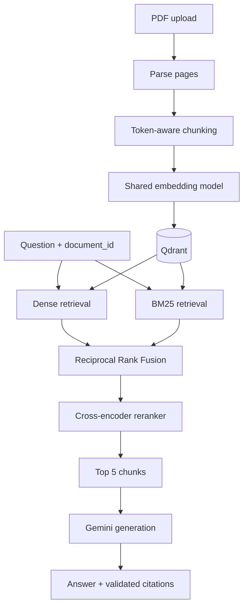

# Production RAG API

A production-style Retrieval-Augmented Generation (RAG) system for uploading PDF documents and asking grounded questions about them. The API parses and chunks PDFs, stores vector embeddings in Qdrant, combines dense and lexical retrieval, reranks the best candidates with a cross-encoder, and uses Gemini to generate answers with page-level citations.

## Features

- PDF upload through a FastAPI endpoint
- Token-aware chunking with overlap
- Dense retrieval using `sentence-transformers/all-MiniLM-L6-v2`
- BM25 lexical retrieval
- Reciprocal Rank Fusion (RRF) for hybrid search
- Cross-encoder reranking with `cross-encoder/ms-marco-MiniLM-L-6-v2`
- Grounded Gemini answers with validated citations
- Multiple-document support with strict `document_id` isolation
- Deterministic Qdrant point IDs that prevent collisions between documents
- Document deletion and BM25 cache invalidation
- Shared embedding model for ingestion and retrieval
- Structured logging and Langfuse tracing
- Unit tests and retrieval evaluation tooling

## Architecture



Every retrieval stage is restricted to the requested `document_id`. A query cannot retrieve or cite chunks belonging to another uploaded PDF.

## Technology stack

- Python 3.12
- FastAPI and Uvicorn
- Qdrant
- Sentence Transformers
- BM25 (`rank-bm25`)
- Google Gemini
- Langfuse
- PyMuPDF
- Pydantic
- pytest
- Ruff
- uv

## Project structure

```text
production-rag/
├── src/rag/
│   ├── api/                 # FastAPI application and schemas
│   ├── generation/          # Prompt construction, Gemini client, citations
│   ├── ingestion/           # PDF parsing, chunking, ingestion service
│   ├── observability/       # Logging and Langfuse integration
│   └── retrieval/           # Embeddings, Qdrant, BM25, hybrid search, reranking
├── evaluation/              # Evaluation datasets, scripts, and results
├── scripts/                 # Development ingestion/query utilities
├── tests/                   # Unit and API tests
├── pyproject.toml
└── README.md
```

## Prerequisites

Install the following before running the project:

- Python 3.12
- [uv](https://docs.astral.sh/uv/)
- Docker
- A Gemini API key

The first application start may download the embedding and reranker models from Hugging Face.

## Installation

Clone the repository and install the locked dependencies:

```bash
git clone git@github.com:haider-sattar/production-rag.git
cd production-rag
uv sync
```

Create a local `.env` file:

```env
GEMINI_API_KEY=your_gemini_api_key
```

If Langfuse is enabled in your configuration, also provide its credentials:

```env
LANGFUSE_PUBLIC_KEY=your_public_key
LANGFUSE_SECRET_KEY=your_secret_key
LANGFUSE_HOST=https://cloud.langfuse.com
```

Never commit `.env`. Keep an `.env.example` containing empty placeholder values in the repository.

## Start Qdrant

Run Qdrant locally with persistent storage:

```bash
docker run --name production-rag-qdrant \
  -p 6333:6333 \
  -p 6334:6334 \
  -v "$(pwd)/qdrant_storage:/qdrant/storage" \
  qdrant/qdrant
```

If the container already exists, start it with:

```bash
docker start production-rag-qdrant
```

Qdrant will be available at `http://localhost:6333`.

## Run the API

```bash
uv run uvicorn rag.api.app:app --reload
```

Wait for `Application startup complete`. The API is then available at `http://127.0.0.1:8000`.

Interactive API documentation is available at:

```text
http://127.0.0.1:8000/docs
```

## API usage

### Health check

```bash
curl http://127.0.0.1:8000/health
```

Response:

```json
{
  "status": "ok"
}
```

### Upload a PDF

```bash
curl -X POST http://127.0.0.1:8000/documents \
  -F "file=@./data/sample.pdf"
```

Response:

```json
{
  "document_id": "4014ea07-3ae0-482f-93d9-b459f2c87b15",
  "filename": "sample.pdf",
  "page_count": 20,
  "chunk_count": 56
}
```

The API accepts PDF files up to 20 MB. It validates the filename, rejects empty files, and verifies the PDF header before ingestion.

### Ask a question

Use the `document_id` returned by the upload endpoint:

```bash
curl -X POST http://127.0.0.1:8000/query \
  -H "Content-Type: application/json" \
  -d '{
    "document_id": "4014ea07-3ae0-482f-93d9-b459f2c87b15",
    "question": "What does the document say about observability?"
  }'
```

Response:

```json
{
  "answer": "The document describes observability as the ability to reconstruct a system state from measured outputs...",
  "citations": [
    {
      "source_id": 1,
      "filename": "sample.pdf",
      "page_number": 16,
      "chunk_index": 44
    }
  ]
}
```

An unknown or deleted `document_id` returns HTTP `404`:

```json
{
  "detail": "No indexed chunks found for the requested document_id"
}
```

### Delete a document

```bash
curl -X DELETE \
  http://127.0.0.1:8000/documents/4014ea07-3ae0-482f-93d9-b459f2c87b15
```

Response:

```json
{
  "document_id": "4014ea07-3ae0-482f-93d9-b459f2c87b15",
  "deleted": true
}
```

Deletion removes every matching vector from Qdrant and invalidates the document's in-memory BM25 cache.

## Retrieval pipeline

The final retrieval configuration was selected through experiments rather than chosen only from defaults:

1. Dense retrieval and BM25 each retrieve candidates belonging to the requested document.
2. Reciprocal Rank Fusion combines the two ranked lists with `rrf_constant=60`.
3. Duplicate results are removed, including page-level deduplication.
4. The best 30 hybrid candidates are scored by the cross-encoder.
5. The final five chunks are passed to Gemini as grounded context.

The ingestion pipeline uses chunks of up to 220 tokens with a 40-token overlap. The same embedding model instance is shared by document ingestion and query retrieval during application startup.

## Retrieval evaluation

Retrieval was evaluated on 45 audited, page-level questions. The final reranked configuration produced:

| Metric | Score | Questions |
|---|---:|---:|
| Hit@1 | 0.6667 | 30/45 |
| Hit@3 | 0.9333 | 42/45 |
| Hit@5 | 0.9333 | 42/45 |
| MRR | 0.7889 | — |

The experiments showed the following progression at Hit@5:

| Retrieval method | Hit@5 |
|---|---:|
| Dense retrieval | 0.6889 |
| Hybrid RRF with deduplication | 0.8889 |
| Hybrid + cross-encoder reranking | 0.9333 |

Candidate-pool testing also showed that 30 candidates produced the best Hit@1 and MRR while preserving the best Hit@3 and Hit@5:

| Reranker candidates | Hit@1 | Hit@3 | Hit@5 | MRR |
|---:|---:|---:|---:|---:|
| 10 | 0.6444 | 0.9111 | 0.9111 | 0.7704 |
| 20 | 0.6444 | 0.9333 | 0.9333 | 0.7778 |
| 30 | 0.6667 | 0.9333 | 0.9333 | 0.7889 |

Run retrieval evaluation with:

```bash
uv run python evaluation/evaluate_retrieval.py \
  --retriever reranked \
  --rerank-candidates 30
```

Evaluation output is written under `evaluation/results/`.

## Tests and code quality

Run the full test suite:

```bash
uv run pytest
```

Run lint checks:

```bash
uv run ruff check src tests evaluation scripts
```

The tests cover parsing and chunking behavior, prompt construction, generated-answer validation, document-isolated queries, PDF upload validation, document deletion, and failure handling. API tests use lightweight fake components so they do not load Hugging Face models, call Gemini, or connect to Qdrant.

## Design decisions

### Document isolation

Every PDF receives a unique `document_id`. Dense Qdrant searches and BM25 searches require that identifier, preventing content from separate documents from being mixed in one answer.

### Collision-free vector IDs

Qdrant point IDs are deterministic UUID5 values derived from `document_id` and `chunk_index`. Chunk zero in one PDF therefore cannot overwrite chunk zero from another PDF.

### Citation validation

The model receives numbered source chunks. Returned citation IDs are validated against those sources before the API response is created, so the application does not trust arbitrary filenames or page numbers generated by the model.

### Immediate consistency

Qdrant writes and deletions wait for completion. After an upload succeeds, the document can be queried immediately; after deletion succeeds, its chunks are no longer retrievable.

### Observability

Requests use structured logs with request and document identifiers, timing data, retrieved chunk counts, and citation counts. Langfuse records separate retrieval and generation observations for inspecting the complete RAG request.

## Current limitations

- Only text-based PDFs are supported; scanned PDFs require OCR before ingestion.
- Uploaded source files are temporary. Their parsed chunks and metadata remain in Qdrant.
- Document metadata is stored with chunks rather than in a separate document registry.
- The API currently has no authentication or user-level authorization.
- Model startup and the first request can be slower while local Hugging Face models load.
- The in-memory BM25 cache is local to one API process, so multi-worker deployment needs shared or rebuilt lexical state.

## License

Add a license before distributing or reusing the project publicly.
